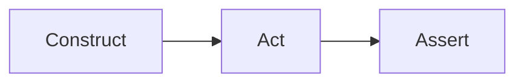

# Material components

Enable each of these in `mkdocs.yml`'s `markdown_extensions:` (shown per
component below) — match the shape of what you're saying to the right
component instead of writing another paragraph of prose for it.

## Tabs: showing variant forms of the same thing

```yaml
markdown_extensions:
  - pymdownx.tabbed:
      alternate_style: true
```

Use tabs when several examples are genuinely the *same concept* shown
different ways — different construction sources for the same object,
short-form vs. full-form syntax, different languages for the same
snippet — not as a generic "put unrelated things in a smaller box"
device:

```markdown
=== "Short form"

    ```bash
    tool run --flag value
    ```

=== "Full form"

    ```yaml
    flag: value
    ```
```

If a reader would reasonably want to compare two tabs side by side,
that's a sign they shouldn't be tabs — use a table instead.

## Admonitions: a warning should look like a warning

```yaml
markdown_extensions:
  - admonition
  - pymdownx.details   # adds the collapsible ??? variant
```

```markdown
!!! warning "Re-adding an already-registered entry is a silent no-op"
    Calling this twice with the same identifier doesn't error - it just
    skips the second call. If a test depends on the side effect actually
    running twice, force it explicitly.

??? note "Why this uses a query parameter instead of a JSON body field"
    Click to expand a longer aside that would otherwise break the
    reading flow of the main explanation.
```

Types worth knowing: `note`, `tip`, `warning`, `danger`, `example`,
`quote` — each carries a distinct color/icon in Material, so picking the
right one is itself signal (`danger` for "this will corrupt state if you
get it wrong," not for a mild caveat). A bare `!!!` block command
("give this its own visual break") is the right call whenever a warning
is currently just sitting inline in a paragraph, easy to skim past.

## Grid cards: a landing page's own navigation

```markdown
<div class="grid cards" markdown>

-   :material-rocket-launch:{ .lg .middle } **Getting started**

    ---

    One real, complete example — install it, run it, see it work.

    [:octicons-arrow-right-24: Read the guide](getting-started.md)

</div>
```

Use on `index.md` (or any hub page) to present 3-5 top-level entry
points with an icon, a one-line description, and a link — the visual
equivalent of a landing page's hero section, not a replacement for
`nav:`.

## Abbreviations

```yaml
markdown_extensions:
  - abbr
```
See [`writing.md`](writing.md)'s abbreviations section for the
per-page `*[TERM]: expansion` convention this powers.

## Mermaid diagrams

```yaml
markdown_extensions:
  - pymdownx.superfences:
      custom_fences:
        - name: mermaid
          class: mermaid
          format: !!python/name:pymdownx.superfences.fence_code_format
```
Then a fenced ` ```mermaid ` block renders as a real diagram, no
external image to keep in sync:
````markdown

````
Reach for this over a hand-drawn image whenever the diagram is a real
flow/state-machine/sequence a maintainer might need to edit later — a
text-based diagram is something the next person can actually change in
a PR.

## Code annotations

```yaml
theme:
  features:
    - content.code.annotate
```
Numbered markers inside a code block that expand into an explanation on
click/hover — use for "here's the one non-obvious line in an otherwise
ordinary block," not for annotating every line (that's what prose
before the block is for):
````markdown
```yaml
strategy:
  type: RollingUpdate  # (1)!
```

1. Zero-downtime by default; switch to `Recreate` only if the app can't
   run two versions concurrently.
````

## `content.code.copy` / `content.code.select`

```yaml
theme:
  features:
    - content.code.copy
    - content.code.select
```
Low-cost, high-value defaults: a copy button on every code block, and
(with `.select`) the ability to select just the command in a block that
mixes commands with their output. Turn these on for any project without
a specific reason not to.
